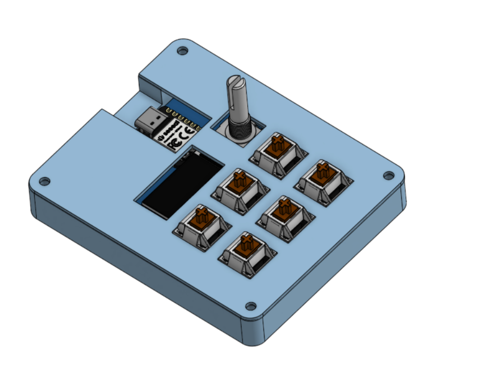
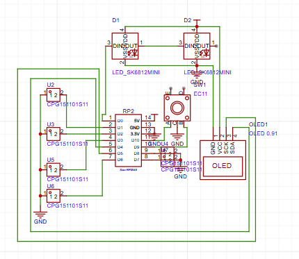
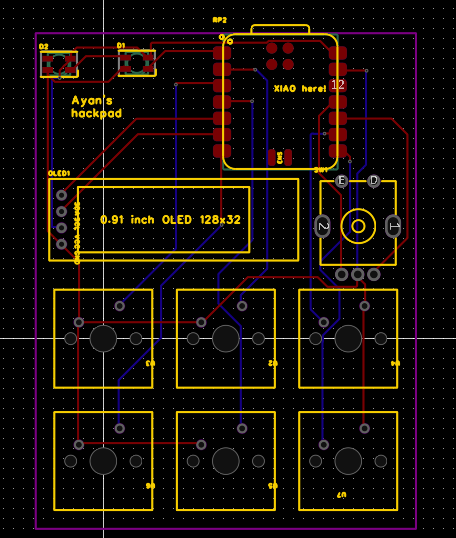

# vspad
This is my first PCB project. It is a macropad that I will use when coding with VSCode in order to make it a more efficient and effective experience. I haven't yet decided exactly what command each key will do, so the code may be edited in the future.

---

## Specifications

BOM:
* 6x cherry MX switches
* 2x SK6812 MINI LEDs
* 1x XIAO RP2040
* 1x EC11 rotary encoder
* 6x Blank DSA Keycaps
* 4x M3x16 Bolt
* 4x M3 Heatset

---
## Schematic

---

## PCB

